# MakeCode 介绍与使用方法

**特别注意：**下面两个压缩包文件一定要下载，后面会用到。

 
 

[1.安装Microbit驱动](1.安装Microbit驱动.zip)

[2.其他相关资料](2.其他相关资料.zip)

## 1. 安装 Makecode IDE

Micro:bit是一款无需安装IDE产品，只需要在网页上进行编程下载即可。网址：[https://makecode.microbit.org/](https://makecode.microbit.org/)

当然如果需要离线版本，请参考以下内容：

1. Makecode离线软件下载链接：[https://makecode.microbit.org/offline-app](https://makecode.microbit.org/offline-app)

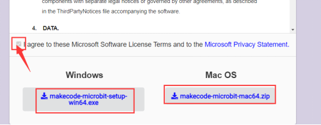

2. Makecode离线软件更新教程：

首先，我们打开软件，在右上角点击“**设置**”图案，然后再点击“**关于**”。

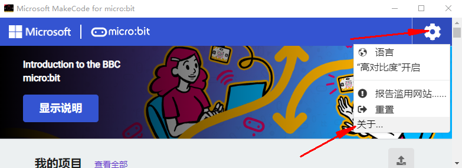

然后进入“**关于**”界面，点击“确定”确定是最新版本。

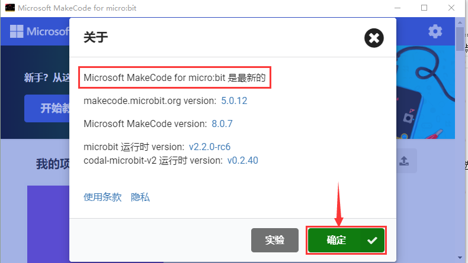

## 2. Micro:bit驱动安装说明：

Micro:bit是可以免安装USB驱动的。如果你的电脑识别不了Micro:bit主板，则需要安装一下Micro:bit驱动，我们提供有Micro:bit 驱动文件和安装Micro:bit驱动说明书，你可以进入相关文件夹中根据安装说明书进行安装。

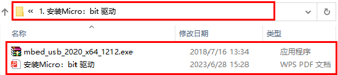

## 3. 快速开始  

以下的步骤说明基于Windows操作系统，如果你使用的是其他操作系统，可以将其作为参考。

### （1）代码与编程  

本节介绍如何为Micro:bit编写程序以及如何将其下载到Micro:bit主板。 Micro:bit官方网站上有非常详细的教程， 您可以参考：[Https://microbit.org/guide/quick/](Https://microbit.org/guide/quick/)

#### 步骤 1: 连接Micro:bit主板

通过Micro USB线将Micro:bit主板连接到电脑.

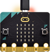

Micro:bit主板背后的红色LED点亮，表明Micro:bit主板有电了。

Micro:bit 将在您的电脑上显示为一个名为'MICROBIT'的驱动器。但请注意，它不是普通的USB磁盘！如下图：

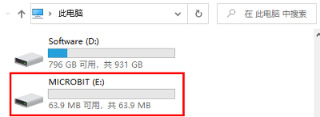

#### 步骤 2: 编写程序

在浏览器中访问链接：[https://makecode.microbit.org/](https://makecode.microbit.org/) ，然后单击“**新建项目**”，出现“**创建项目**”对话框，在对话框中输入“**心跳**”，单击“**创建**”并开始编程。

（以下是以Google Chrome为例，其他浏览器类似）

①使用MakeCode编辑器，写一个Micro:bit代码。 例如，从模块区拖放一些指令方块放入代码编辑区。

下一节将进一步介绍MakeCode。

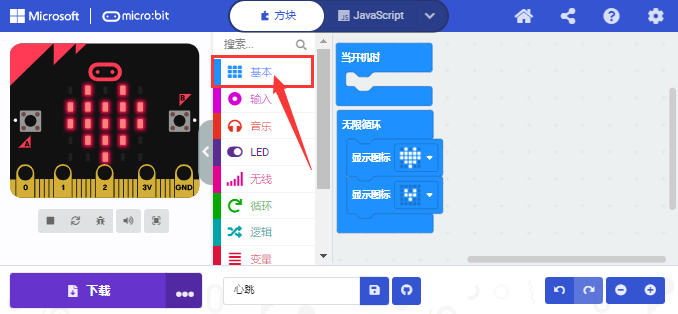

②点击“JS JavaScript”，你可以看到对应的JavaScript语言代码程序，如下图：

③你还可以点击“JS JavaScript ”，再点击下拉按钮选择“Python”，你还可以看到对应的Python语言代码程序，如下图：

#### 步骤 3: 下载代码 

单击编辑器中的“**下载**”按钮。 这将下载一个“hex”文件，该文件是Micro:bit主板可以读取的紧凑程序格式。 十六进制文件下载后，将其复制到你的Micro:bit主板，就像将文件复制到USB驱动器一样。 在Windows上，你还可以右键单击并选择“发送到→MICROBIT（E）”将“hex”文件拷贝到Micro:bit主板。

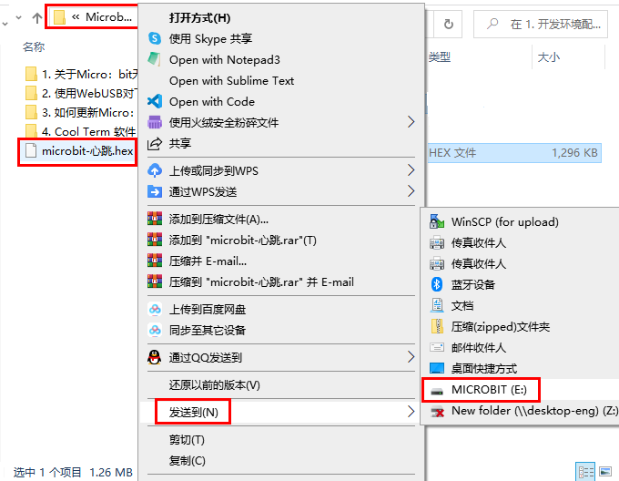

也可以将“.hex”文件直接拖入MICROBIT（E）磁盘中。

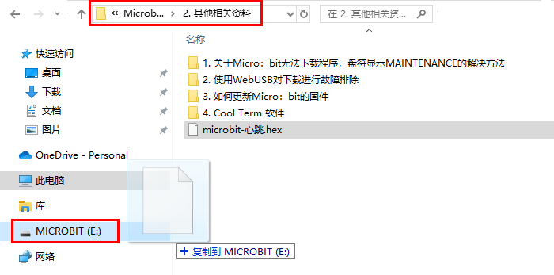

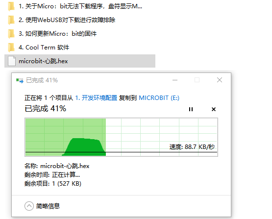

将下载好的“hex”文件拷贝到Micro:bit主板过程中，Micro:bit主板背面的黄色信号灯会闪烁，当拷贝完成后黄色信号灯停止闪烁，保持长亮。

#### 步骤 4: 运行程序 

代码程序上传Micro: bit 主板后，通过Micro USB线或外接电源给Micro: bit主板供电，Micro: bit 主板上的5 x 5 LED点阵显示心跳的图案。

micro USB线供电

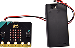

外接电源供电（3.3V）

每次编程时，MICROBIT驱动器都会自动弹出并返回，但是你的hex文件将会消失。 Micro: bit主板只能接收.hex文件，不会存储任何其他文件！

#### 步骤 5：掌握

本小节向你展示了如何开始使用Micro:bit，但是除了MakeCode之外，您还可以使用Python语言和基于文本的JavaScript语言来编写Micro:bit。转到：[https://microbit.org/code/](https://microbit.org/code/) 查看不同的语言，或查看：[https://microbit.org/projects/](https://microbit.org/projects/) ，了解你可能想要尝试的一些内容。

### （2）MakeCode 编辑器

在Google Chrome访问链接：https://makecode.microbit.org/ ， 打开MakeCode在线版本

点击 “**新建项目**”,出现“**创建项目**”对话框，在对话框中输入“**心跳**”，单击“**创建**”进入MakeCode 编译器，MakeCode 编译器如下: 

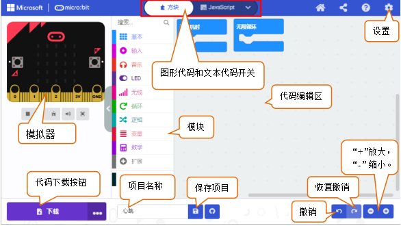

在代码编辑区中，有两个固定的指令方块“**当开机时**”和“**无限循环**”。 
上电或复位后，“**当开机时**”指令方块中的代码将仅执行一次；并且“**无限循环**”指令方块中的代码将循环执行。

### （3）快速下载                                                           
使用MakeCode的浏览器版本下载编写好的代码程序可能需要更多步骤。 但是，如果您将Google Chrome 用于Android，ChromeOS，Linux，macOS和Windows 10系统，则可以实现快速下载功能。 

在这里，我们使用Chrome的webUSB功能，该功能允许网页访问您的Micro USB硬件设备。 我们将按照以下步骤完成Micro：bit设备与网页的连接和配对。 

**配对装置：**

用Micro USB线连接电脑和Micro: bit主板。

单击“**下载**”后面的“**...**”，然后单击“**连接设备**”。

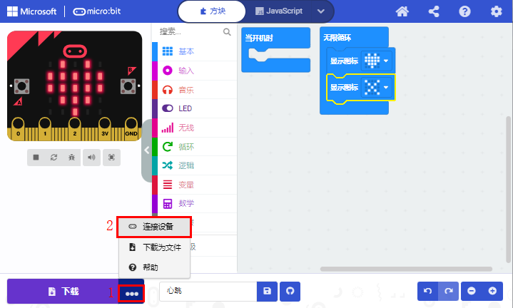

然后继续单击“**下一步**”按钮。

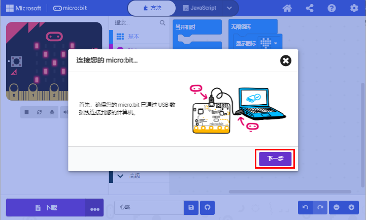

再继续单击“**下一步**”按钮。

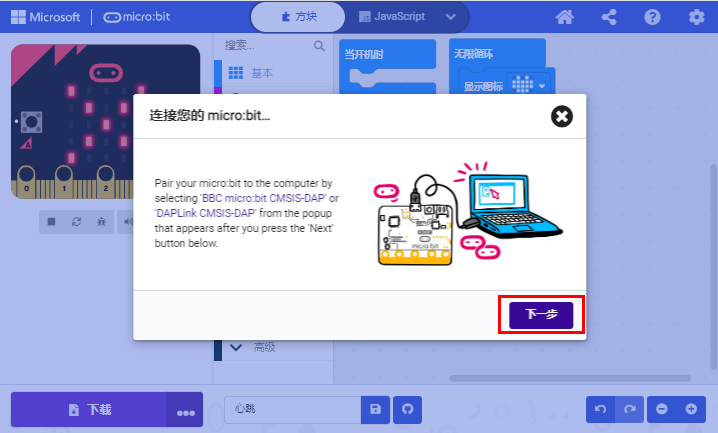

在弹出窗口中选中对应的“**设备**”，然后单击“**连接**”按钮。 如果弹出窗口中没有设备，请参考以下内容：[https://makecode.microbit.org/device/usb/webusb/troubleshoot](https://makecode.microbit.org/device/usb/webusb/troubleshoot) 

当然，如果你不想点击链接进入相关页面中查看，你也可以在本教程的“其他相关资料”文件夹中直接阅读“**用WebUSB排除下载过程中的故障**”文件。

如果你的Micro:bit主板出现问题是需要更新Micro:bit主板的固件，在“其他相关资料”文件夹中的“**如何更新micro:bit主板的固件**”文件介绍了如何更新Micro:bit主板的固件，其内容来自：[https://microbit.org/guide/firmware/](https://microbit.org/guide/firmware/) 

单击“**完成**”，设备连接成功。

**程序下载：**

设备连接成功后，单击“**下载**”按钮，程序将直接下载到Micro:bit主板。

注意：有的系统不支持快速下载方式，比如在电脑的设备管理器中可以看到在线驱动CMSIS-DAP安装不成功就不支持快速下载；需要选择其它程序上传方式。比如：**右键单击并选择“发送到→MICROBIT（E）”将“hex”文件拷贝到Micro:bit主板。** 等程序上传方式。
 
 

## 3. MakeCode扩展库：

为了轻松学会添加MakeCode扩展库，我们以添加和删除**Mecanum&nbsp;Robot&nbsp;Car V2.0**扩展库为例，方法如下：

#### （1）添加Mecanum Robot Car V2.0扩展库： 

您可以通过以下方法添加Mecanum Robot Car V2.0扩展库文件。 

打开MakeCode，先点击右上角的齿轮图标（设置），再点击“扩展”。

或者单击“**高级**”上的“**扩展**”。

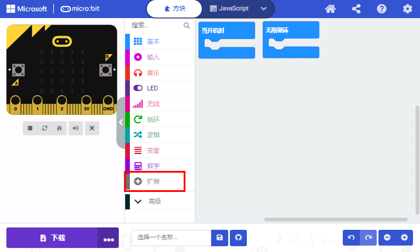

在搜索框中输入链接：[https://github.com/keyestudio2019/mecanum_robot_v2.git](https://github.com/keyestudio2019/mecanum_robot_v2.git) ，然后单击搜索。 

单击搜索结果MecanumRobotV2以下载并安装。 该过程可能需要几秒钟。

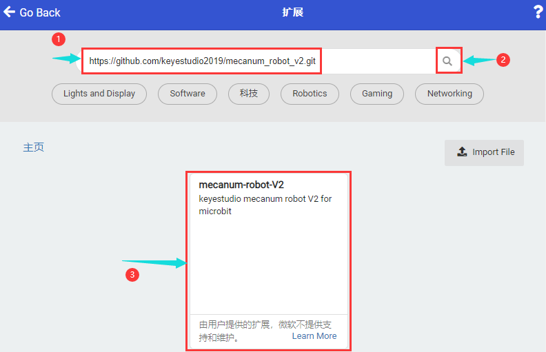

安装完成后，你可以在左侧找到MecanumRobotV2的扩展库。

注意：添加到项目中的扩展库仅对该项目有效，而不会出现在其他项目中。 因此，当你创建新项目代码时，需要再次添加MecanumRobotV2扩展库。

#### （2）更新或删除MecanumRobotV2扩展库：

如果您需要更新或删除MecanumRobotV2扩展库文件，请按照以下说明进行操作。 

点击 "Js JavaScript" 按钮切换到文本代码。

点击左边的“**资源管理器**”.

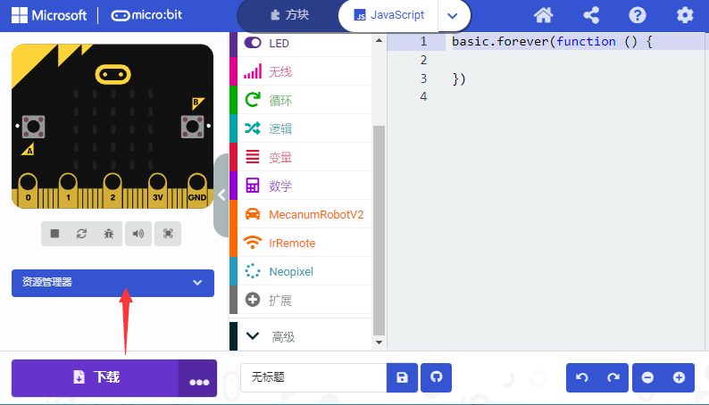

在扩展列表中找到扩展库文件。单击垃圾箱图标以删除MecanumRobotV2扩展库文件。单击刷新图标以更新MecanumRobotV2扩展库文件。

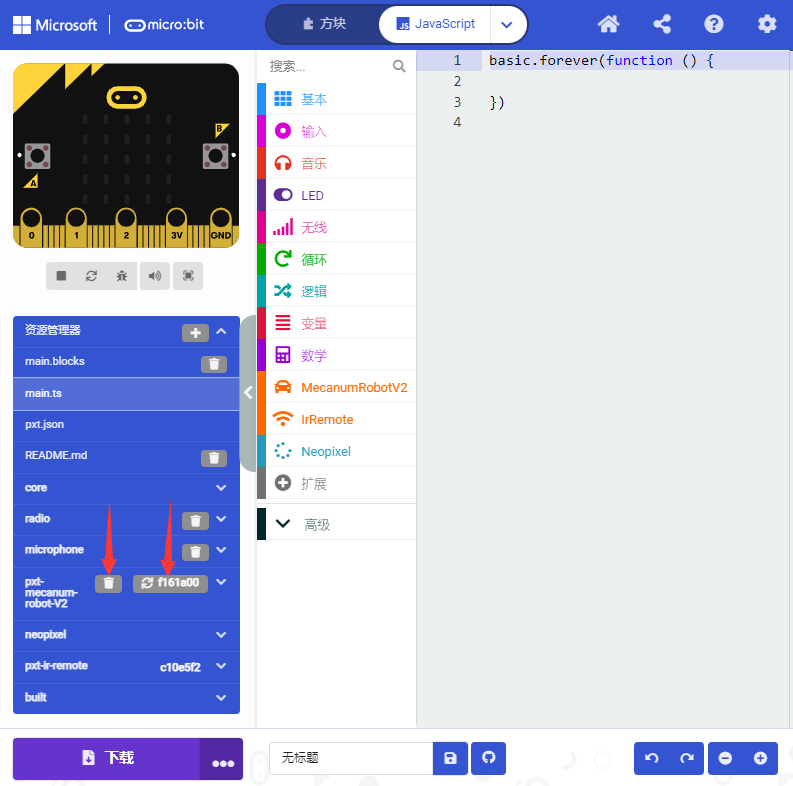

## 4. 导入代码：  

我们为每个项目提供十六进制代码文件（项目文件）。十六进制代码文件包含项目的所有内容，可以直接导入，你也可以手动拖动代码块来完成每个项目的代码程序。如果选择通过手动拖动代码块来完成项目代码，则可能需要添加必要的扩展库。

对于简单项目，建议通过拖动代码块来完成项目。

对于复杂的项目，建议通过导入我们提供的十六进制代码文件来完成项目。

接下来，我们以“心跳”项目为例，介绍如何加载代码。

打开Web版本MakeCode编辑器或离线版本MakeCode编辑器，单击“**导入**”。

在弹出的对话框中，单击“**导入文件**”。

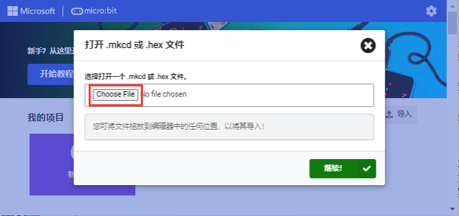

选择文件“ \microbit-心跳.hex”。 然后点击“继续！√”。

除了上述将提供的项目代码程序文件直接导入到Makecode编译器中的方法之外，也可以将我们提供的项目代码程序文件直接拖入到Makecode编译器中的代码编辑区，如下图所示：

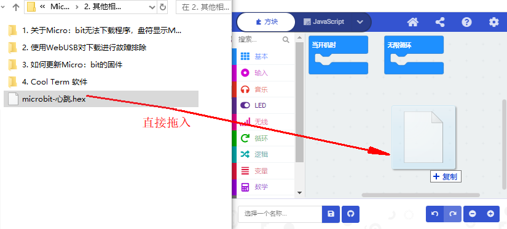

几秒钟后，项目成功加载。

注意：如果你的电脑系统是Windows7/8而不是Windows 10，则在Google Chrome中是无法进行设备配对，从而读取不了一些传感器/模块的数字信号或模拟信号，可是又需要读取相应的传感器/模块的数字信号或模拟信号，那怎么办呢？这里就可以使用CoolTerm软件来读取串口数据的，下面是CoolTerm安装方法。

## 5. CoolTerm软件安装方法：

这里需要安装CoolTerm程序软件，CoolTerm程序软件是用来在下面的一些实验中读取串口通讯的，这里我们提供了CoolTerm程序软件的下载链接：[https://freeware.the-meiers.org/](https://freeware.the-meiers.org/)

（1）现在，让我们来安装CoolTerm程序软件，这里我们是以PC Windows系统为例，选择下载安装CoolTerm Win，下载后解压并打开。（Mac系统和 Linux系统也类似）

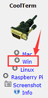

（2）左键双击程序文件。（注意：必须保证micro:bit驱动已安装和micro:bit主板连接到电脑上）

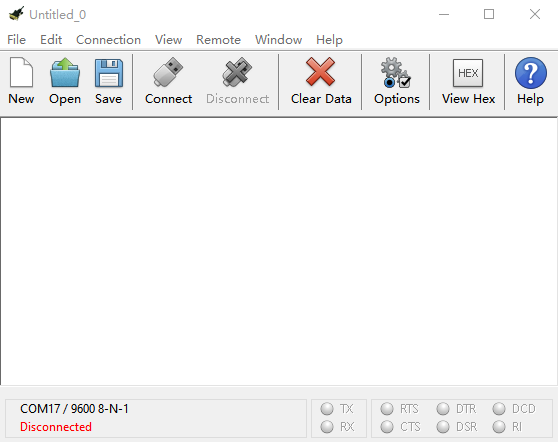

工具栏上每个按钮的功能如下所示：

||打开一个新的终端机|
| :--: | :--: |
||打开保存好的连接|
||保存|
||打开串行连接|
||关闭串行连接|
||清除接收到的数据|
||打开“连接选项”对话框|
||以十六进制格式显示终端数据|
||帮助|
